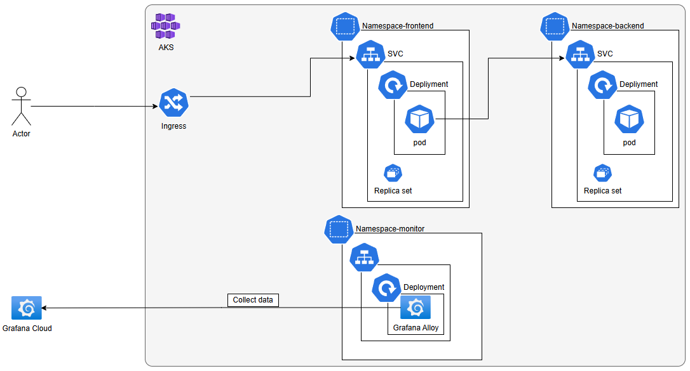
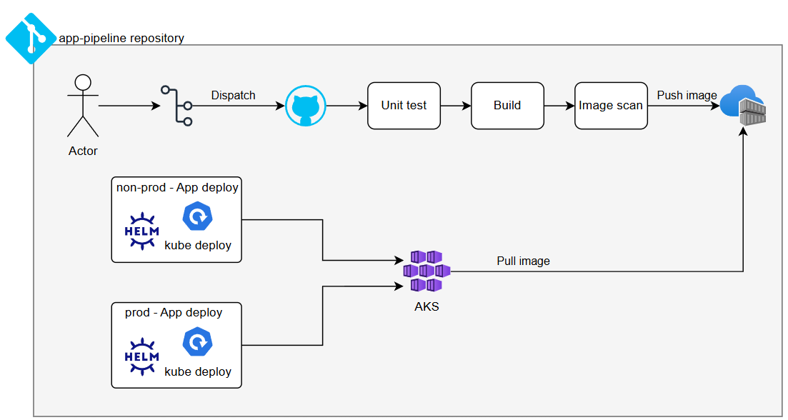
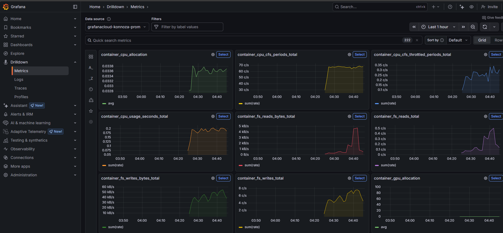
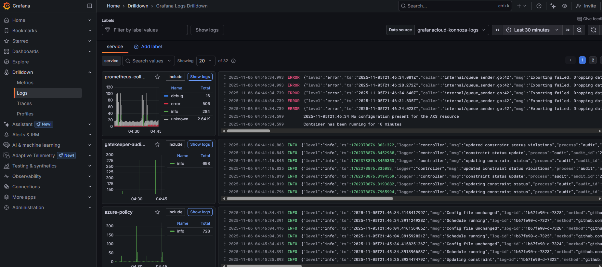

# Demo
# App Pipeline Repository

This repository contains the necessary components and configurations for a full-stack application, including its frontend, backend, and continuous integration/continuous deployment (CI/CD) pipelines for automated deployment.

# Stack

| **Phase**            | **Tool/Platform**                                              |
| -------------------- | -------------------------------------------------------------- |
| **Cloud Provider**   | **Azure**                                                      |
| **Microservices**    | **Python (Flask) for Backend, Node.js (Express) for Frontend** |
| **Containerization** | **Docker**                                                     |
| **Orchestration**    | **Kubernetes service (AKS)**                                   |
| **IaC**              | **Terraform**                                                  |
| **CI/CD**            | **GitHub Actions**                                             |
| **Observability**    | **Prometheus, Grafana, & Loki (Cloud)**                        |

# Architecture

## Application

## CI/CD Diagram

The following diagram illustrates the CI/CD process for this application:

This diagram outlines dispatch to deployment, ensuring efficient delivery pipeline.

## Pipeline Status

| Workflow | Status |
|---|---|
| Build & Push Backend |  |
| Build & Push Frontend |  |
| Deploy Backend Staging |  |
| Deploy Frontend Staging |  |

## Log and monitor
- Use Grafana cloud to integrate via ``Grafana Alloy`` agent to easy to integrate Observability

## Project Structure

- `backend/`: Contains the Python backend application, its Dockerfile, and dependencies.
- `frontend/`: Contains the Node.js frontend application, its Dockerfile, and dependencies.
- `.github/workflows/`: Stores GitHub Actions workflows for CI/CD.
- `helm/`: Contains Helm charts for deploying the application to Kubernetes.
- `deploy/`: Contains environment-specific deployment configurations.

## CI/CD Pipelines

This repository utilizes GitHub Actions to automate the build, push, and deployment processes:

- `build-push-be.yaml`: Builds the backend Docker image and pushes it to a container registry.
- `build-push-fe.yaml`: Builds the frontend Docker image and pushes it to a container registry.
- `deploy-be-stg.yaml`: Deploys the backend application to the staging environment using Helm.
- `deploy-fe-stg.yaml`: Deploys the frontend application to the staging environment using Helm.
- `deploy-be-stg.yaml`: Deploys the backend application to the production environment using Helm.
- `deploy-fe-stg.yaml`: Deploys the frontend application to the production environment using Helm.

## How to Deploy the Project

To deploy this project, use **GitHub Actions**: The deployment is automated via GitHub Actions. Pushing changes to the main branch (or a configured branch) will trigger the build, push, and deployment workflows.
    - The `build-push-be.yaml` and `build-push-fe.yaml` workflows will build and push the respective Docker images.
    - The `deploy-<fe/be>-<env>.yaml` workflows will then use the Helm charts in the `helm/` directory to deploy the applications to the staging environment.